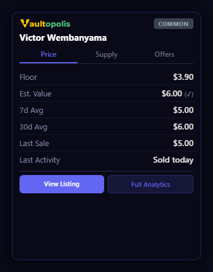
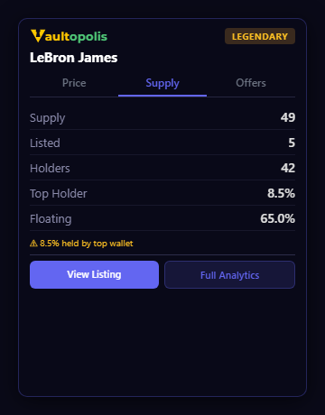
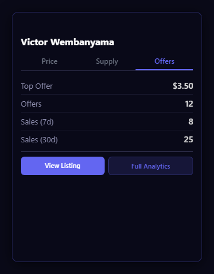
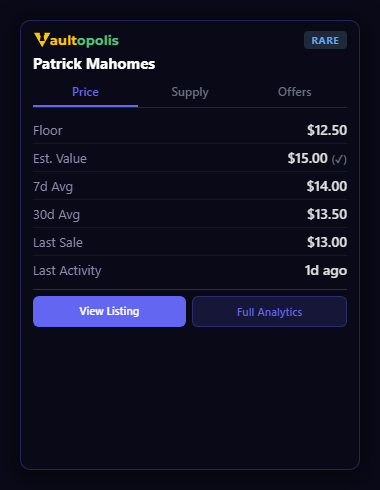
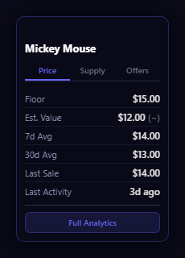
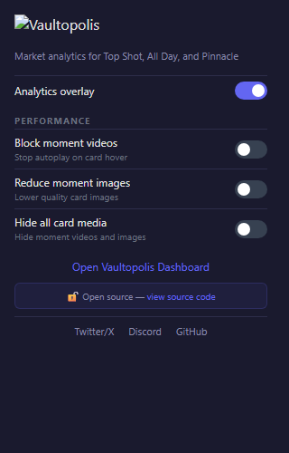

# Vaultopolis — Collectibles Market Analytics Extension

  

Open-source Chrome extension that gives you instant market intelligence on NBA Top Shot, NFL All Day, and Disney Pinnacle — right on the marketplace page.

Hover over any listing and instantly see what it's actually worth: floor price, estimated value, 7-day and 30-day averages, who's holding it, how liquid it is, and whether the market is active or dead. No more opening tabs, no more guessing, no more overpaying.

<p align="center">
  
  
  
</p>
<p align="center">
  
  
  
</p>

## Why open source?

Browser extensions have access to the pages you visit. We believe you should be able to verify exactly what an extension does before installing it. This repository contains the complete, unobfuscated source code. There is no difference between what you see here and what runs in the extension.

## Features

### Instant analytics on every card

Hover over any listing and a clean overlay appears with three tabs of data:

- **Price** — Floor price, estimated value with confidence indicator, 7d/30d sale averages, last sale price, and when it last traded. See at a glance if something is priced above or below its recent market value.
- **Supply** — Total supply, how many are listed, unique holder count, top wallet concentration, and floating supply percentage. Know immediately if a market is thin, concentrated, or healthy.
- **Offers** — Highest active offer, total offer count, and 7d/30d sales volume. Understand demand before you buy.

### Make the marketplace actually usable

The official marketplace pages are heavy — autoplay videos, large images, and slow rendering. Vaultopolis includes built-in performance controls:

- **Block moment videos** — Stop autoplay videos that lag your browser when scrolling through listings
- **Reduce moment images** — Lower image quality so pages load faster, especially with hundreds of cards
- **Hide all card media** — Strip videos and images entirely for the fastest possible browsing experience

These aren't gimmicks. If you've ever had Top Shot freeze your browser while scrolling through 200+ listings, or waited 10+ seconds for All Day cards to render, these toggles make the marketplace usable again. Especially on older machines or slower connections.

### Works across three marketplaces

One extension, three platforms. The overlay adapts automatically — full-width on Top Shot and All Day, compact mode on Pinnacle's narrower cards.

## Privacy and trust

Browser extensions can be sketchy. This one is different:

- **No data collection** — Zero analytics, zero tracking, zero telemetry. We don't know who you are and we don't want to.
- **No wallet access** — Cannot see your account, credentials, NFTs, or purchase history.
- **No browsing history** — Only runs on the three marketplace domains. Cannot see any other site you visit.
- **No remote code** — Everything is bundled locally. No CDNs, no dynamic imports, no eval().
- **No account required** — Install and go. No sign-up, no login, no email.
- **Fully open source** — Every line of code is right here. Audit it yourself.

See [PRIVACY.md](PRIVACY.md) for the full privacy policy and [SECURITY.md](SECURITY.md) for the security architecture.

## Supported marketplaces

| Marketplace | URL |
|-------------|-----|
| NBA Top Shot | nbatopshot.com |
| NFL All Day | nflallday.com |
| Disney Pinnacle | disneypinnacle.com |

## Install

1. Download the latest zip from the [Releases page](https://github.com/LibruaryNFT/vaultopolis-extension/releases)
2. Unzip to any folder
3. Open Chrome and go to `chrome://extensions`
4. Turn on **Developer mode** (toggle in the top right)
5. Click **Load unpacked** and select the unzipped folder
6. Visit any supported marketplace and hover over a listing card

That's it — no accounts, no build tools, no sign-up.

## Build from source (for developers)

If you want to verify or modify the code yourself:

```bash
git clone https://github.com/LibruaryNFT/vaultopolis-extension.git
cd vaultopolis-extension
npm install    # dev dependencies only (esbuild)
npm run build  # bundles src/ → dist/
```

Then load in Chrome using the same steps above (Load unpacked → select the repo folder).

## Project structure

```
src/
├── tooltip.js            # Analytics overlay UI (Shadow DOM)
├── content.js            # NBA Top Shot content script
├── content-allday.js     # NFL All Day content script
├── content-pinnacle.js   # Disney Pinnacle content script
├── background.js         # Service worker (API calls + caching)
├── popup.js              # Settings popup logic
├── popup.html            # Settings popup UI
└── detectors/
    ├── topshot.js        # Card detection for Top Shot
    ├── allday.js         # Card detection for All Day
    └── pinnacle.js       # Card detection for Pinnacle
```

## API endpoints

The extension calls these **public, read-only** endpoints on `api.vaultopolis.com`. No authentication required. No API keys.

| Endpoint | Purpose | Cache TTL |
|----------|---------|-----------|
| `/topshot-market-data` | Top Shot prices + analytics | 15 min |
| `/allday-market-data` | All Day prices + analytics | 15 min |
| `/pinnacle-market-data` | Pinnacle prices + analytics | 15 min |
| `/topshot-data` | Top Shot metadata (fallback) | 1 hour |
| `/allday-data` | All Day metadata (fallback) | 1 hour |
| `/pinnacle-data` | Pinnacle metadata (fallback) | 1 hour |
| `/topshot-uuid-map` | UUID → numeric ID mapping | 24 hours |

## Permissions

| Permission | Why |
|------------|-----|
| `storage` | Save toggle preferences locally |
| `nbatopshot.com/*` | Run content script on Top Shot |
| `nflallday.com/*` | Run content script on All Day |
| `disneypinnacle.com/*` | Run content script on Pinnacle |
| `api.vaultopolis.com/*` | Fetch public market data |

No access to other websites, tabs, history, bookmarks, passwords, clipboard, camera, microphone, or geolocation.

## Testing

```bash
# Headless tooltip rendering tests (47 assertions)
node test/tooltip-headless.test.js

# Visual + interaction tests with screenshots (26 assertions)
node test/tooltip-visual.test.js

# Detector validation (card detection patterns)
node test/detector-validation.js
```

## Security

- Zero runtime dependencies (esbuild bundles at build time)
- Shadow DOM isolation prevents host page interference
- All dynamic content HTML-escaped via `textContent`
- No `eval()`, no `innerHTML` with raw user input, no remote code
- Minimal Chrome permissions (storage only)

Report vulnerabilities privately via [Twitter DM](https://x.com/vaultopolis) or [Discord](https://discord.gg/nJdwqYfenh). Do not open public issues for security reports.

## Feedback and suggestions

Have ideas, found a bug, or want to request a feature? Join the conversation:

- **Discord** — [discord.gg/nJdwqYfenh](https://discord.gg/nJdwqYfenh)
- **Twitter/X** — [@vaultopolis](https://x.com/vaultopolis)
- **GitHub Issues** — [open an issue](https://github.com/LibruaryNFT/vaultopolis-extension/issues)

## Contributing

Contributions welcome. Please open an issue first to discuss what you'd like to change.

## License

[MIT](LICENSE) — Libruary
